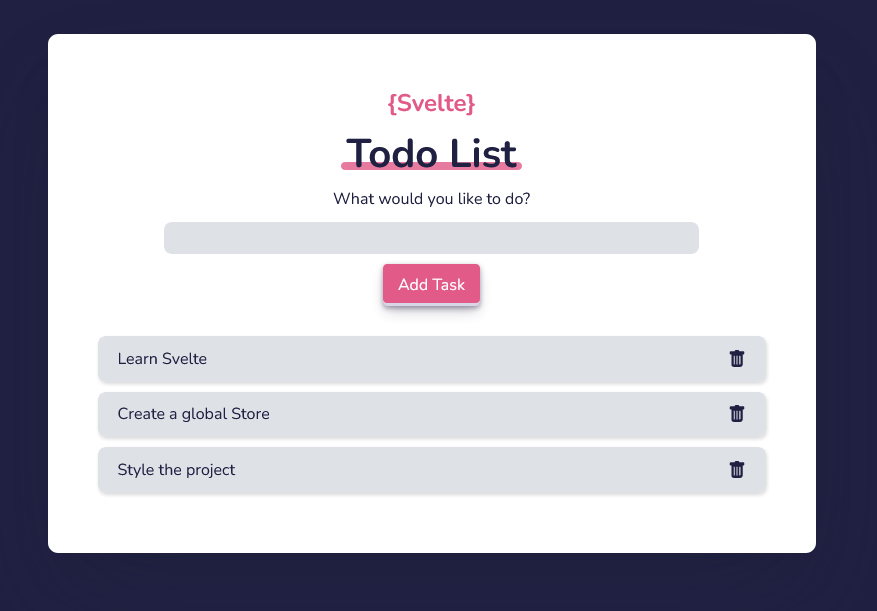

<h1 align="center">
  Feedback Form using Svelte
</h1>

<p align="center">
  
  
  
  
  

  <a href="https://github.com/humbruno/svelte-feedback-app/commits/master">
    
  </a>
  
  <a href="https://github.com/humbruno/svelte-feedback-app/issues">
    
  </a>
</p>

<p align="center">
  
</p>

## 💻 Project

This is a simple Feedback Form using Svelte, developed as a way to practice the Svelte syntax and data management through components using the Stores concept.

The form allows the user to delete existing reviews, as well as write a new review by entering the text and selecting a rating from 1 to 10.

There is validation when it comes to the length of the review text, as well as calculatations to show the number of reviews and the average rating of all existing reviews.

The initial 3 reviews that initialize the project are saved using a Store, and new reviews/deleted reviews are updated automatically in the store file.

Dependencies used for this project:

- [Svelte](https://svelte.dev/)
- [UUID Generator](https://www.uuidgenerator.net/version4)

## 🔌 Live Website Link

- [Live Website](https://svelte-feedback.brunosantos.dev/)

## 📥 Installing and executing

Clone this repository and access the directory.

```bash
# Instaling dependencies
$ npm install

# Executing the application
$ npm run dev
```
